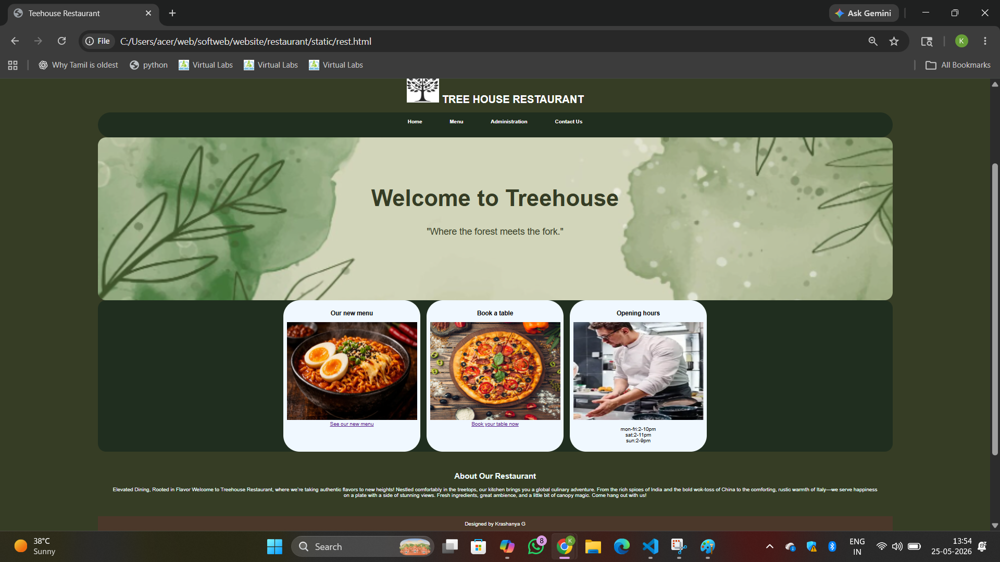
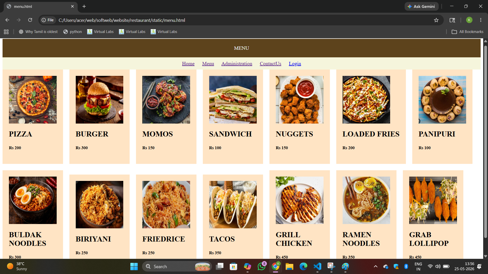
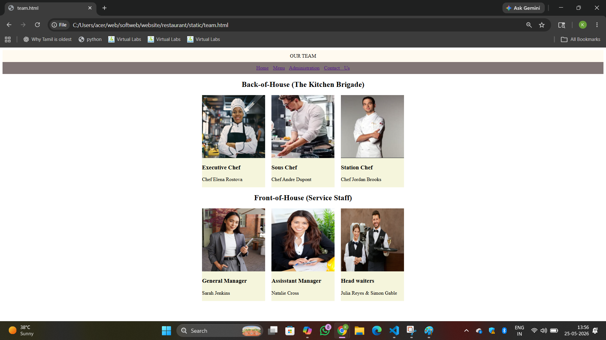
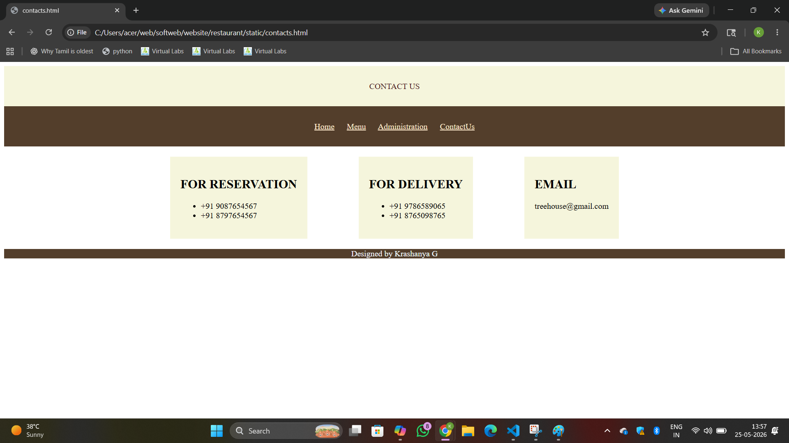

# Ex.06 Restuarant Website
## Date: 25.06,26

## AIM:
To develop a static Resturant website to display the menu and services provided by the resturant.

## DESIGN STEPS:

### Step 1:
Requirement collection.

### Step 2:
Creating the layout using HTML and CSS.

### Step 3:
Updating the sample content.

### Step 4:
Choose the appropriate style and color scheme.

### Step 5:
Validate the layout in various browsers.

### Step 6:
Validate the HTML code.

### Step 7:
Publish the website in the given URL.

## PROGRAM:
rest.html
```
<!DOCTYPE html>
<html>
<head>
    <title>Teehouse Restaurant</title>

    <style>
        body{
            margin:0;
            font-family:Arial;
            background-color:#363d25;
            padding: 300px;px;
            gap:20px;
            
        }

        header{
            background-color:#363d25;
            color:white;
            text-align:center ;
            gap:50px;
            

            
        }


        nav{
            background-color:#202e1f;
            padding:40px;
            text-align:center;
            border-radius: 100px;
            gap: 20px;
            padding-top: 20px;
            width:auto;
            text-align: center;
        }

        nav a{
            text-decoration:none;
            color:rgb(255, 255, 255);
            padding:40px;
            font-weight:bold;
        }

        .banner{
            background-image:url("bgi.png");
            background-size:cover;
            background-position:center;
            height:300px;
            width:auto;
            align-items: center;
            text-align:center;
            color:#363d25;
            padding:100px;
            border-radius: 25px;
            gap:50px;
            

        }

        .banner h1{
            font-size:70px;
            font-weight:bold;
        }

        .banner p{
            font-size:28px;
        }
        .container{
            
            display:flex;
            flex-wrap: wrap;
            justify-content: center ;
            gap:20px;
            background-color: #202e1f;
            border-radius: 25px;


        }
        .pan img{
            height:300px;
            width:400px;
    
        }
        .pan h3{
            text-align: center;
        }
        .pan{
            background-color: aliceblue;
            text-align: center;
            border-radius: 50px;
            padding:10px;
        }


        .content{
            text-align:center;
            padding:40px;
            color:azure;
        }

        footer{
            background-color:#4b382a;
            color:white;
            text-align:center;
            padding:15px;
        }
    </style>
</head>

<body>

<header>

    <h1>  TREE HOUSE RESTAURANT </h1>
    
</header>

<nav>
    <a href="rest.html">Home</a>
    <a href="menu.html">Menu</a>
    <a href="team.html">Administration</a>
    <a href="contacts.html">Contact Us</a>
    
</nav>

<div class="banner">
    <h1>Welcome to Treehouse </h1>
    <p>"Where the forest meets the fork."</p>
</div>
<div class="container">
    <div class="pan">
        <h3> Our new menu</h3>
        <br>
        <a href="menu.html">See our new menu</a>
    </div>
    <div class="pan">
        <h3>Book a table</h3>
        <br>
        <a href="contacts.html">Book your table now</a>
    </div>
    <div class="pan">
        <h3>Opening hours</h3>
        
        <p>mon-fri:2-10pm <br>
            sat:2-11pm<br>
            sun:2-9pm
         </p>
    </div>

</div>


<div class="content">
    <h2>About Our Restaurant</h2>
    <p>
        Elevated Dining, Rooted in Flavor
        Welcome to Treehouse Restaurant, where we’re taking authentic flavors to new heights! Nestled 
        comfortably in the treetops, our kitchen brings you a global culinary adventure. From the rich spices of India 
        and the bold wok-toss of China to the comforting, rustic warmth of Italy—we serve happiness on a plate with a 
        side of stunning views. Fresh ingredients, great ambience, and a little bit of canopy magic. Come hang out with us!
    </p>
</div>

<footer>
    Designed by Krashanya G
</footer>

</body>
</html>
```
menu.html
```
<html>
    <head>
        <style>
            header{
                padding:20px;
                background-color:rgb(93, 67, 28);
                color:aliceblue;
                text-align: center;
                

            }
            nav{
                background-color: beige;
                color:black;
                padding:10px;
                text-align: center;
                word-spacing: 20px;
            }
            .item{
                padding:20px;
                background-color:bisque;
                align-items:
                

            }
            .item h2{
                color:black;
                text-align:left
                
            }
            .item img{
                height: 150px;
                width: 150px;
            }
            
            .menu-container
            {
            display: flex;
            flex-wrap: wrap;
            align-items: center;
            gap: 20px;
           
            }
            
        </style>

    </head>
    <body>
        <header>
            MENU
        </header>
        <nav>
            <a href="rest.html">Home</a>
            <a href="menu.html">Menu</a>
            <a href="team.html">Administration</a>
            <a href="contacts.html">ContactUs</a>
            
        </nav>
        <div class="menu-container">
            <div class="item">
                
                <h2>PIZZA</h2>
                <h5>Rs 200</h5>
            </div>
            <div class="item">
                
                <h2>BURGER</h2>
                <h5>Rs 300</h5>
            </div>
            <div class="item">
                
                <h2>MOMOS</h2>
                <h5>Rs 150</h5>
            </div>
            <div class="item">
                
                <h2>SANDWICH</h2>
                <h5>Rs 100</h5>
            </div>
            <div class="item">
                
                <h2>NUGGETS</h2>
                <h5>Rs 150</h5>
            </div>
            <div class="item">
                
                <h2>LOADED FRIES</h2>
                <h5>Rs 200</h5>
            </div>
            <div class="item">
                
                <h2>PANIPURI</h2>
                <h5>Rs 100</h5>
            </div>
            <div class="item">
                
                <h2>BULDAK<br>NOODLES</h2>
                <h5>Rs 300</h5>
            </div>
            <div class="item">
                
                <h2>BIRIYANI</h2>
                <h5>Rs 250</h5>
            </div>
            <div class="item">
                
                <h2>FRIEDRICE</h2>
                <h5>Rs 250</h5>
            </div>
            <div class="item">
                
                <h2>TACOS</h2>
                <h5>Rs 350</h5>
            </div>
            <div class="item">
                
                <h2>GRILL<BR> CHICKEN</h2>
                <h5>Rs 450</h5>
            </div>
             <div class="item">
                
                <h2>RAMEN<BR>NOODLES</h2>
                <h5>Rs 350</h5>
            </div>
             <div class="item">
                
                <h2>GRAB<BR>LOLLIPOP</h2>
                <h5>Rs 450</h5>
            </div>

        </div>
    </body>
</html>
```
team.html
```
<html>
    <head>
        <style>
            header{
                background-color: floralwhite;
                padding: 10px;
                text-align: center;

            }
            nav{
                background-color: rgb(129, 117, 117);
                padding: 10px;
                word-spacing: 10px;
                text-align: center;
                
            }
            .team-container{
                display:flex;
                justify-content: center;
                align-items: center;
                flex-wrap: wrap;
                gap:20px;
                
                
            }
            .team img{
                height:200px;
                width:200px;
            }
            .team{
                background-color: beige;
                align-content: center;
            }

        </style>
        
    </head>
    </head>
    <body>
        <header>
            OUR TEAM
        </header>
        <nav>
            <a href="rest.html">Home</a>
            <a href="menu.html">Menu</a>
            <a href="team.html">Administration</a>
            <a href="contacts.html">Contact Us</a>
        
        </nav>
        <h2 align="center">Back-of-House (The Kitchen Brigade)<br></h2>
        <div class="team-container">
            <div class="team">
                
                <h3>Executive Chef </h3>
                <p>Chef Elena Rostova</p>
            </div>
            <div class="team">
                
                <h3>Sous Chef </h3>
                <p>Chef Andre Dupont </p>
            </div>
            <div class="team">
                
                <h3>Station Chef </h3>
                <p>Chef Jordan Brooks</p>
            </div>

        </div>
        <h2 align="center">Front-of-House (Service Staff)</h2>
        <div class="team-container">
            <div class="team">
                
                <h3>General Manager </h3>
                <p>Sarah Jenkins</p>
            </div>
            <div class="team">
                
                <h3>Assisstant Manager </h3>
                <p>Natalie Cross</p>
            </div>
            <div class="team">
                
                <h3>Head waiters</h3>
                <p>Julia Reyes & Simon Gable</p>
            </div>
        </div>


    </body>
</html>
```
contact us
```
<html>
    <head>
        <style>
            header{
                color:rgb(74, 30, 30);
                text-align: center;
                
                background-color:beige;
                padding:30px;
            }
            nav{
                background-color:rgb(83, 62, 43);
                padding:30px;
                text-align: center;
                word-spacing: 20px;
            
            }
            a{
                color:aliceblue
            }
            a:hover {
                color: rgb(255, 255, 255);
            }
            a:visited{
                color:blanchedalmond;
            }
            .ph-container{
                display:flex;
                flex-wrap: wrap;
                justify-content: center;
                gap:100px;
                padding:20px;

            }
            .ph{
                background-color: beige;
                padding:20px;
            
            }
            footer{
                background-color: rgb(83, 62, 43);
                color:aliceblue;
                text-align: center;
            }
            
        </style>

    </head>
    <body>
        <header>
            CONTACT US
        </header>
        <nav>
            <a href="rest.html">Home</a>
            <a href="menu.html">Menu</a>
            <a href="team.html">Administration</a>
            <a href="contacts.html">ContactUs</a>
        
        </nav>
        <div class="ph-container">
            <div class="ph">
                <h2>FOR RESERVATION</h2>
                <ul>
                    <li>+91 9087654567</li>
                    <li>+91 8797654567</li>
                </ul>
            </div>
            <div class="ph">
                <h2>FOR DELIVERY</h2>
                <ul>
                    <li>+91 9786589065</li>
                    <li>+91 8765098765</li>
                </ul>
            </div>
            <div class="ph">
                <h2>EMAIL</h2>
                <p>treehouse@gmail.com</p>
            </div>

        </div>
        <footer>
            Designed by Krashanya G
        </footer>

    </body>
</html>
```


## OUTPUT:
home page:


Menu page:


Team page:


Contact us page:

## RESULT:
The program for designing software company website using HTML and CSS is completed successfully.
